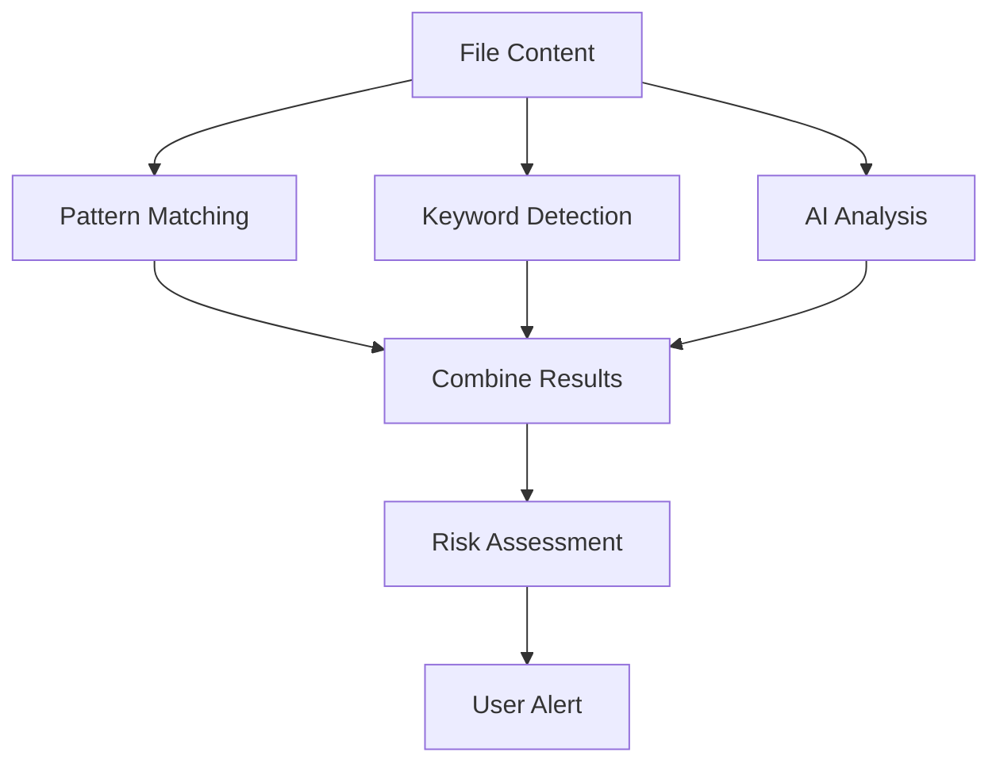

# Scan with AI - Sensitive Data Detection

## Overview

The "Scan with AI" functionality is a comprehensive privacy protection feature that analyzes file content to detect potentially sensitive information before making files public. This system combines pattern matching, keyword detection, and AI analysis to provide users with intelligent alerts about privacy risks.

## Features

### 🔍 **Multi-Layer Detection**

- **Pattern Matching**: Detects structured data like credit cards, SSNs, phone numbers
- **Keyword Analysis**: Identifies sensitive terms and contexts
- **AI Analysis**: Advanced semantic understanding of content privacy risks

### 🛡️ **Privacy Protection**

- **Pre-Share Scanning**: Automatically triggered when making files public
- **Risk Assessment**: Categorizes content as LOW, MEDIUM, or HIGH risk
- **Smart Recommendations**: Provides actionable advice based on scan results

### 🎯 **User Experience**

- **Seamless Integration**: Built into the file sharing workflow
- **Clear Alerts**: User-friendly warnings with detailed explanations
- **Choice Preservation**: Users can still proceed after being informed

## How It Works

### 1. Detection Triggers

The scanning system is automatically triggered when:

- A user attempts to make a private file public through the Share Modal
- A user manually runs "Scan with AI" from the file menu

### 2. Scanning Process



### 3. Detection Categories

#### Pattern-Based Detection

- **Credit Card Numbers**: Luhn algorithm validation
- **Social Security Numbers**: US format patterns
- **Phone Numbers**: Various international formats
- **Email Addresses**: RFC-compliant patterns
- **API Keys**: Common API key formats
- **Bank Account Numbers**: Account number patterns

#### Keyword-Based Detection

- **Financial**: "credit card", "bank account", "salary", "tax return"
- **Authentication**: "password", "username", "api key", "secret key"
- **Personal**: "social security", "passport", "driver license"
- **Medical**: "medical record", "patient id", "insurance number"
- **Legal**: "confidential", "attorney-client", "non-disclosure"

#### AI-Based Detection

- **Contextual Analysis**: Understanding document purpose and content
- **Semantic Understanding**: Identifying sensitive content beyond keywords
- **Risk Assessment**: Evaluating overall privacy implications
- **Confidence Scoring**: Measuring detection certainty

## Implementation

### Backend Components

#### SensitiveDataScanService

```typescript
// Location: cloudnestbackend/src/services/SensitiveDataScanService.ts

export class SensitiveDataScanService {
  public static async scanForSensitiveData(
    textContent: string,
    filename: string
  ): Promise<SensitiveDataScanResult>;
}
```

**Key Methods:**

- `scanForSensitiveData()`: Main scanning orchestrator
- `scanWithPatterns()`: Regex pattern matching
- `scanWithKeywords()`: Keyword detection
- `scanWithAI()`: AI-powered analysis
- `combineResults()`: Intelligent result merging

#### FileController Enhancement

```typescript
// New endpoint: POST /api/files/:id/scan-sensitive

public static async scanForSensitiveData(req: Request, res: Response)
```

### Frontend Components

#### ScanWithAI Modal

```typescript
// Location: cloudfrontend/src/component/Dashboard/Files/ScanWithAI.tsx

interface ScanWithAIProps {
  fileId: string;
  filename: string;
  onScanComplete: (result: ScanResult) => void;
  onClose: () => void;
  isOpen: boolean;
}
```

**Features:**

- File scanning interface
- Loading states and error handling
- Integration with backend API

#### SensitiveDataAlert Modal

```typescript
// Location: cloudfrontend/src/component/Dashboard/Files/SensitiveDataAlert.tsx

interface SensitiveDataAlertProps {
  scanResult: ScanResult;
  filename: string;
  onProceedPublic: () => void;
  onKeepPrivate: () => void;
  onClose: () => void;
  isOpen: boolean;
}
```

**Features:**

- Risk level visualization
- Detailed scan results display
- User choice handling (proceed or keep private)

#### ShareModal Integration

The ShareModal has been enhanced to automatically trigger scanning when users attempt to make files public:

```typescript
const setPublicAccess = async (makePublic: boolean) => {
  // If making file public, trigger AI scan first
  if (makePublic && !isPublic) {
    setPendingPublicStatus(makePublic);
    setShowScanModal(true);
    return;
  }
  // ... rest of logic
};
```

## Usage Examples

### Automatic Scanning

1. User opens Share Modal for a private file
2. User clicks "Anyone with the link" to make file public
3. System automatically triggers AI scan
4. If sensitive data is detected, user sees alert with options
5. User can choose to proceed or keep file private

### Manual Scanning

1. User right-clicks on file in file table
2. User selects "Scan with AI" from dropdown menu
3. Scan modal opens and performs analysis
4. Results are displayed in alert modal
5. User is informed about privacy risks

### Demo Page

A comprehensive demo page is available at `/sensitive-scan-demo` that allows testing with:

- Pre-built sample texts with different risk levels
- Custom text input
- Real-time scanning results
- Detailed explanations of the scanning process

## Risk Assessment

### Risk Levels

#### HIGH Risk

- **Triggers**: Credit cards, SSNs, passwords, API keys
- **Confidence**: >70% AI confidence or pattern matches
- **Action**: Strong warning with detailed explanation

#### MEDIUM Risk

- **Triggers**: Personal information, sensitive keywords
- **Confidence**: 40-70% AI confidence or keyword matches
- **Action**: Caution warning with recommendations

#### LOW Risk

- **Triggers**: Minimal or no sensitive indicators
- **Confidence**: <40% AI confidence, no patterns
- **Action**: Proceed with minimal warning

### Confidence Scoring

- **Pattern Matches**: 90% confidence (high accuracy)
- **AI Analysis**: Variable based on model confidence
- **Keyword Matches**: 60% confidence (context-dependent)
- **Combined Score**: Weighted average of all methods

## Configuration

### Environment Variables

```bash
# Required for AI analysis
OPENROUTER_API_KEY=your_openrouter_api_key

# Application URL for API requests
APP_URL=http://localhost:3000
```

### AI Model Configuration

```typescript
// Uses Mistral 7B Instruct for analysis
const model = 'mistralai/mistral-7b-instruct';

// Optimized parameters for sensitive data detection
{
    max_tokens: 500,
    temperature: 0.1,  // Low temperature for consistent results
    top_p: 0.9
}
```

## Security Considerations

### Data Handling

- **No Storage**: Scanned content is not stored permanently
- **Processing Only**: Content is analyzed in memory and discarded
- **API Security**: All requests require authentication tokens

### Privacy Protection

- **User Control**: Users always have final decision
- **Transparency**: Clear explanations of what was detected
- **Opt-Out**: Users can choose to skip scanning

### Error Handling

- **Graceful Degradation**: System works without AI if service unavailable
- **Fallback Methods**: Pattern and keyword detection continue if AI fails
- **User Notification**: Clear error messages when scanning fails

## API Reference

### Scan File Endpoint

```http
POST /api/files/:fileId/scan-sensitive
Authorization: Bearer <token>
Content-Type: application/json

{
    "textContent": "optional text content"
}
```

**Response:**

```json
{
  "success": true,
  "message": "File scanned successfully",
  "data": {
    "fileId": "file_id",
    "filename": "document.txt",
    "scanResult": {
      "containsSensitiveData": true,
      "riskLevel": "HIGH",
      "confidence": 0.95,
      "sensitiveDataTypes": ["creditCard", "ssn"],
      "details": [
        "Found 1 potential credit card pattern",
        "Found 1 potential SSN pattern"
      ],
      "recommendation": "This file contains potentially sensitive information. Consider keeping it private."
    }
  }
}
```

## Testing

### Unit Tests

```bash
# Test pattern matching
npm test -- SensitiveDataScanService.patterns

# Test keyword detection
npm test -- SensitiveDataScanService.keywords

# Test AI integration
npm test -- SensitiveDataScanService.ai
```

### Integration Tests

```bash
# Test full scanning workflow
npm test -- FileController.scanSensitiveData

# Test UI components
npm test -- ScanWithAI
npm test -- SensitiveDataAlert
```

### Demo Testing

Visit `/sensitive-scan-demo` to test with sample content:

- Financial documents (HIGH risk)
- Login credentials (HIGH risk)
- Personal information (MEDIUM risk)
- Medical records (HIGH risk)
- Legal documents (MEDIUM risk)
- Regular documents (LOW risk)

## Performance

### Optimization Strategies

- **Text Limiting**: Content limited to 2000 characters for AI analysis
- **Async Processing**: Non-blocking scan operations
- **Caching**: Pattern compilation cached for performance
- **Timeout Handling**: 30-second timeout for AI requests

### Scalability

- **Rate Limiting**: Consider implementing rate limits for scanning
- **Queue System**: For high-volume deployments, consider queue processing
- **Model Optimization**: Use efficient AI models for faster processing

## Future Enhancements

### Planned Features

- **Custom Patterns**: Allow users to define custom sensitive patterns
- **Batch Scanning**: Scan multiple files simultaneously
- **Compliance Reports**: Generate privacy compliance reports
- **Machine Learning**: Improve detection accuracy over time

### Integration Opportunities

- **DLP Systems**: Integration with Data Loss Prevention tools
- **Compliance Tools**: GDPR, HIPAA compliance checking
- **Audit Logging**: Detailed logging for compliance audits

## Troubleshooting

### Common Issues

#### AI Service Unavailable

- **Symptom**: Scanning fails with AI errors
- **Solution**: Check OPENROUTER_API_KEY configuration
- **Fallback**: Pattern and keyword detection still work

#### High False Positives

- **Symptom**: Too many false sensitive data detections
- **Solution**: Adjust keyword lists and AI prompt tuning
- **Mitigation**: Lower confidence thresholds

#### Performance Issues

- **Symptom**: Slow scanning times
- **Solution**: Optimize text processing and limit content size
- **Monitoring**: Track scanning response times

### Debug Information

- **Backend Logs**: Check console for scanning details
- **Frontend DevTools**: Monitor API calls and responses
- **AI Response**: Log AI model responses for debugging

## Conclusion

The Scan with AI functionality provides comprehensive privacy protection for CloudNest AI users. By combining multiple detection methods and providing clear user guidance, it helps prevent accidental exposure of sensitive information while maintaining user control and transparency.

The system is designed to be extensible, performant, and user-friendly, providing a solid foundation for advanced privacy protection features in cloud storage applications.
